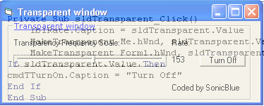



## Transparent effect

### Description

This coding can be used to whatever you want. I hope you like it, it took a while to create. I will probably find use of this little coding, maybe you will too? All it does is creating a transparent-effect in your window. Not so advanced. If you have any compliments about it, feel free to contact me.
 
### More Info
 

             |
---                |---
**Submitted On**   |2004-08-28 11:01:02
**By**             |[SonicBlue](https://github.com/Planet-Source-Code/PSCIndex/blob/master/ByAuthor/sonicblue.md)
**Level**          |Intermediate
**User Rating**    |4.6 (23 globes from 5 users)
**Compatibility**  |VB 5\.0, VB 6\.0
**Category**       |[Graphics](https://github.com/Planet-Source-Code/PSCIndex/blob/master/ByCategory/graphics__1-46.md)
**World**          |[Visual Basic](https://github.com/Planet-Source-Code/PSCIndex/blob/master/ByWorld/visual-basic.md)
**Archive File**   |[Transparen1786898282004\.zip](https://github.com/Planet-Source-Code/sonicblue-transparent-effect__1-55860/archive/master.zip)

